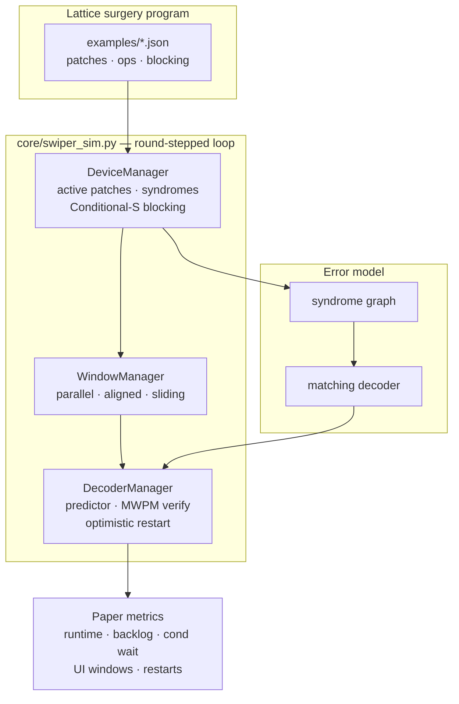

<div align="center">

# QEC-Playground

**The first open-source full SWIPER-SIM behavioral model for speculative window decoder research**

*Companion open-source implementation for* [**An Analysis of Speculative Window Decoders for Quantum Error Correction**](https://arxiv.org/abs/2606.24048)  
Jocelyn Li and Margaret Martonosi · [arXiv:2606.24048](https://arxiv.org/abs/2606.24048) · QCCC-26 workshop (June 2026)

[](https://arxiv.org/abs/2606.24048)
[](https://huggingface.co/spaces/Tunti35/qec-playground)
[](LICENSE)
[](https://www.python.org/)
[](#tests)

*Round-stepped lattice surgery · syndrome graph · matching decoder · Li & Martonosi paper metrics*

[🚀 Try the live demo](https://huggingface.co/spaces/Tunti35/qec-playground) · [📄 Read the paper](https://arxiv.org/abs/2606.24048) · [⚙️ SWIPER (ISCA 2025)](https://github.com/jviszlai/swiper)

</div>


---

## Why this exists

Li & Martonosi analyze **speculative window decoders** for lattice surgery — when can you decode early on unverified predecessors, and what does that save in runtime, backlog, and conditional wait? Their study uses a modified **SWIPER-SIM** internally, but **no source code ships with the paper**.

**QEC-Playground fills that gap:** an interactive, reproducible, first open-source implementation of the paper’s analysis framework — a **full SWIPER-SIM behavioral model** (DeviceManager, WindowManager, DecoderManager) with real **syndrome graph** construction and a **matching decoder** (MWPM) that confirms or rejects speculation.

> Lightweight Python reimplementation of [jviszlai/swiper](https://github.com/jviszlai/swiper) manager behaviors — **not** the original C++ release or an exact reproduction of paper figures/tables.

---

## At a glance

| | Speculative | Non-speculative |
|---|:---:|:---:|
| **Total decoding time** (default, seed=42) | **17 µs** | 21 µs |
| **Avg conditional wait** | **4.3 µs** | 6.0 µs |
| **Realized speculation rate** | 91.7% | — |
| **Max concurrent decoders** | 4 | 4 |

*Three parallel T-gate injections · 4 processors · 1 µs gates · 90% speculation accuracy · `three_t_injection`*

---

## Architecture



**Managers (SWIPER-SIM behavioral model)**

| Manager | Responsibility |
|---------|----------------|
| **DeviceManager** | Per-round active patches (merge/split), syndrome emission, Conditional-S stall accounting |
| **WindowManager** | Commit/buffer windows, source/sink boundaries, parallel / aligned / sliding strategies |
| **DecoderManager** | Processor pool, boundary predictor, matching verification, poisoned-window restart |

---

## Features

- **Paper-faithful metrics** — total decoding time, window backlog, conditional wait, UI windows, restarts, max/mean concurrent decoders
- **Speculative vs non-speculative** — side-by-side comparison in Streamlit and CLI
- **Lattice surgery programs** — `three_t_injection` (paper default), `merge_split_t` (merge/split + blocking)
- **Tunable axes** from Li & Martonosi — processors, gate speed (1 µs / 2 µs), speculation accuracy, decoder latency, ordering, window strategy
- **Matching-derived speculation rate** — slider gates attempt probability; realized rate comes from MWPM outcomes
- **Export** — CSV, PNG charts, shareable config URL

---

## Quick start

```bash
git clone https://github.com/Tuntii/qec-playground.git
cd qec-playground
pip install -r requirements.txt
streamlit run app.py
```

**Headless CLI** (same `run_simulation()` entry point):

```bash
python app.py
python app.py --cycle-time-us 2 --processors 4 --schedule three_t_injection --window-strategy aligned
```

**Python API:**

```python
from core.simulator import run_simulation

result = run_simulation(seed=42, schedule_id="three_t_injection")
spec = result["speculative"]
print(spec["total_decoding_time_us"], spec["speculation_accuracy_rate"])
```

---

## Live demo

**https://huggingface.co/spaces/Tunti35/qec-playground**

```bash
# Share links from the app
export QEC_DEMO_BASE_URL=https://huggingface.co/spaces/Tunti35/qec-playground
streamlit run app.py
```

<details>
<summary>Deploy / redeploy</summary>

```bash
export HF_TOKEN=your_hf_token
python scripts/deploy_hf_space.py
```

Streamlit Community Cloud: [share.streamlit.io](https://share.streamlit.io) → `app.py` → set `QEC_DEMO_BASE_URL`.

</details>

---

## Project layout

```
qec-playground/
├── app.py                 # Streamlit UI + CLI
├── core/
│   ├── device_manager.py  # Patches, syndromes, blocking
│   ├── window_manager.py  # Window strategies
│   ├── decoder_manager.py # Predictor + verify + restart
│   ├── syndrome_graph.py  # Defect syndromes
│   ├── matching_decoder.py
│   ├── schedule.py        # Lattice surgery programs
│   ├── swiper_sim.py      # Manager orchestrator
│   └── simulator.py       # run_simulation()
├── examples/              # JSON schedules
├── ui/                    # Sliders, charts, export
└── tests/                 # 73 pytest tests
```

---

## Tests

```bash
pip install -r requirements.txt
python -m pytest tests/ -q
python scripts/verify_gating.py
```

---

## Cite

If you use this software in academic work, please cite **both** the analysis paper and SWIPER:

```bibtex
@article{li2026speculative,
  title={An Analysis of Speculative Window Decoders for Quantum Error Correction},
  author={Li, Jocelyn and Martonosi, Margaret},
  journal={arXiv preprint arXiv:2606.24048},
  year={2026}
}
```

**SWIPER (ISCA 2025):** [github.com/jviszlai/swiper](https://github.com/jviszlai/swiper)

---

<div align="center">
**[⭐ Star on GitHub](https://github.com/Tuntii/qec-playground)** · **[🤗 Live Demo](https://huggingface.co/spaces/Tunti35/qec-playground)** · **[📄 Paper](https://arxiv.org/abs/2606.24048)**

MIT — see [LICENSE](LICENSE). Research prototype — not production fault-tolerance tooling.

</div>
