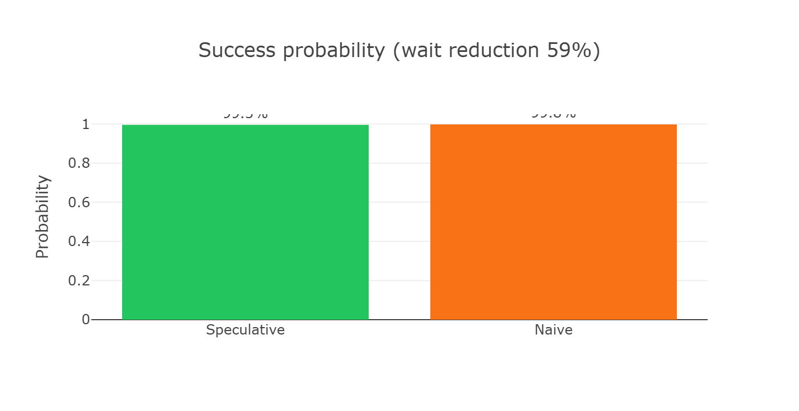

# QEC-Playground

**Surface-GKP kodlarında "Ne zaman skip etsem?" sorusunun canlı cevabı.**



> **24 Haziran 2026** arXiv makalesinin (*Surface-GKP + Speculative Window Decoders*) **ilk açık kaynak implementasyonu**. QuTiP ile GKP simülasyonu, speculative window decoder ve naive baseline karşılaştırması — 2 dakikada parametre denemesi.

## Quick start

```bash
pip install -r requirements.txt
streamlit run app.py
```

Headless CLI (terminal çıktısı):

```bash
python app.py
```

## Interactive demo

Canlı demo (Hugging Face Spaces — Streamlit SDK):

**https://huggingface.co/spaces/tunay/qec-playground**

Deploy sonrası paylaşım linkleri için ortam değişkeni:

```bash
set QEC_DEMO_BASE_URL=https://huggingface.co/spaces/tunay/qec-playground
streamlit run app.py
```

`QEC_DEMO_BASE_URL` ayarlandığında "Share this config" URL'leri canlı demo tabanını kullanır.

### Hugging Face Spaces

1. Yeni Space oluştur → SDK: **Streamlit**
2. Bu repoyu bağla (`app.py` + `requirements.txt` kök dizinde)
3. Space URL'ini yukarıdaki demo linkine ve `QEC_DEMO_BASE_URL`'e yaz

### Streamlit Community Cloud

1. [share.streamlit.io](https://share.streamlit.io) üzerinden repo'yu seç
2. Main file: `app.py`
3. Deploy tamamlanınca çıkan URL'yi `QEC_DEMO_BASE_URL` olarak kullan

## Features

- 5 hazır GKP-surface circuit template + OpenQASM metadata import
- Slider'lar: GKP squeezing (dB), skip threshold, noise, shot count
- Speculative vs naive decoder karşılaştırması (Plotly)
- Export: CSV, PNG grafikler, paylaşılabilir config URL / token

## Project layout

```
app.py              # Streamlit UI + CLI entry
core/               # QuTiP GKP + decoder simulation
ui/                 # Sliders, charts, export, circuit loader
examples/           # 5 JSON circuit templates
assets/             # README hero image
tests/              # pytest suite
```

## Tests

```bash
python -m pytest tests/ -q
```

## Star Cta

Star'ını ver ki quantum dünyasında ilk senin tool'un ünlensin — bu makale için hâlâ başka açık implementasyon yok.

## License

MIT (see repository defaults). Research prototype — not production fault-tolerance tooling.